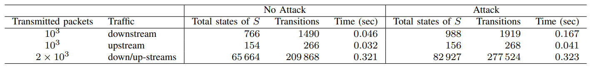
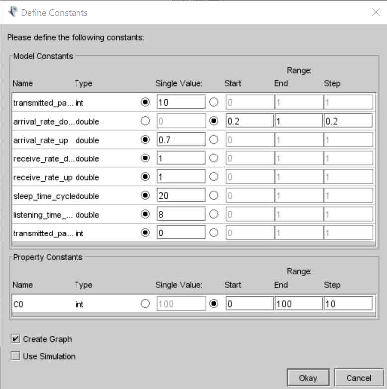
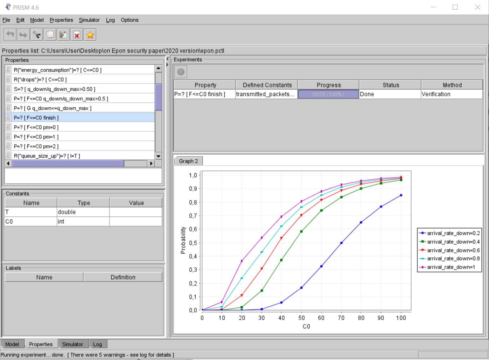
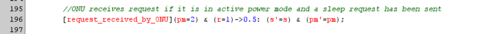
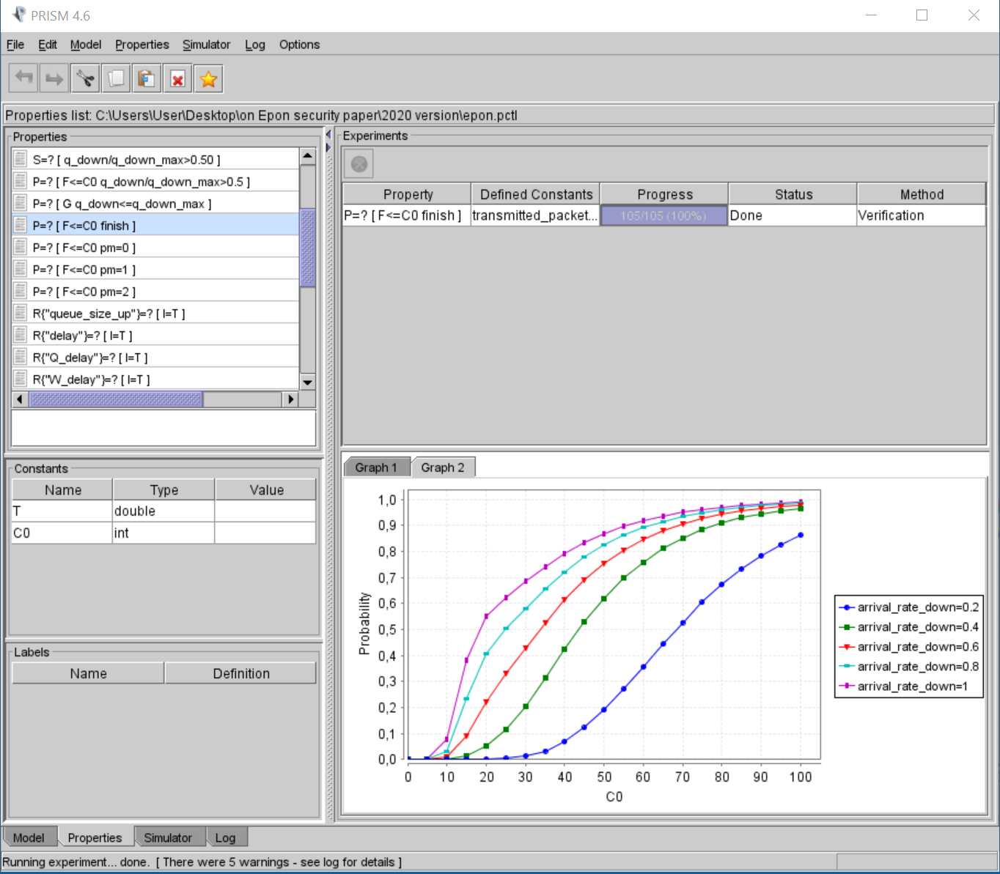

# Quantitative Model Checking for Assessing the Energy Impact of a MITM Attack on EPONs

# Introduction:
This is a model checking approach of an Ethernet Passive Optical Network (EPON) under a MITM attack on an energy-efficient mechanism. It is built in Prism model checker as a CTMC model. 
The modules of the OLT and an ONU along with their queues are modeled to represent the OLT-ONU communication in no attack case senario.
Then, the module of the attacker is added to represent the MITM attack.

# Purpose
We use probabilistic model checking to:       
* represent the OLT-ONU communication under EPON specifications, as well as, the energy mechanism circumvention.

* quantitatively evaluate the impact of a fake Optical Line Terminal (OLT) attacking an EPON energy-efficiency mechanism using probabilistic model checking.
         
# Methodology
The PRISM model checker is used for the design and analysis of the proposed EPON_MITM Continuous-Time Markov Chain (CTMC) model.
* Model checking verifies the property P=? [F≤C0  finish] which provides the probability that all packets have been transmitted and received successfully.
* Cumulative reward properties of the form R~r [C≤ t] are used to evaluate the impact of the attack on the energy-efficiency mechanism.

### Message exchange of the energy-efficient mechanism: 
When the OLT has no traffic in its queue it sends a sleep request to the ONU. If the ONU has no upstrean traffic in its queue, it accepts the sleep request, sends an ack message to the OLT and turns to sleep mode.
Otherwise, if the ONU has upstream traffic in its queue, it sends a nack message and remains active until a new sleep message is sent by the OLT.

### MITM attack on the message exchange of the energy-efficient mechanism: 
The attacker intervens to the message exchange of the energy-efficient mechanism, intercepts the OLT's sleep requests and replies to the OLT with a nack message for each request. Hence, the ONU remains active though its queue is empty.  

### Properties specification: 
A number of properties are implemented to the model to derive the quantitative results in the epon.pctl file.  

### Model statistics: 

The table below shows the statistics for the CTMC model which include: 
* the number of transmitted packets in downstream or upstream;
* the number of states and transitions in the CTMC representing the model;
* the time needed to solve the model.

### The PRISM source code: 
By way of example, the PRISM source code for the attack case scenario is presented below. Expand the "Attack Code" arrow to observe the code.

  

   Attack Code
  

// Ethernet Passive Optical Network - EPON

// OLT - Optical Line Terminal

// ONU - Optical Network Unit

// Modeling a sleep control scheme which aims at reducing ONUs' energy consumption and a sleep mode scheduling technique

// Implementation with queue as a module

	ctmc
// Packet arrival rate lamda

// SCALE *10^2

// we run for 0.01 - 1.01 --> 1 - 101 packets/msec

// Model will finish when the OLT and the ONU send a number of transmitted_packets

// scale *10^2

// we run for 100 - 1000 --> 10.000 - 100.000 packets

	const int transmitted_packets_down;
// Maximum OLT queue size

	const int q_down_max=60;
// Maximum ONU queue size

	const int q_up_max=60;
	const double arrival_rate_down;//ë_down
	const double arrival_rate_up;//ë_up
// Reveive rate of packets (mi = 1)

// SCALE *10^2 --> 100 packets/msec

// =C/L, 1.25 Gbps / 1518 bytes = 1.25*10^9 / 8*1518*10^3 packets/msec

// =12.5*10^5 / 12*10^3 = 100 packets/msec

	const double receive_rate_down;
	const double receive_rate_up;

//constants for cycles 
	
	const int y=1;
	const int x=1;

//Tsleep and Tlisten

	const double sleep_time_cycle; // 20 msec
	const double listening_time_cycle; //8 msec
// TRansition rates

	const double rate_s2l = 1/2 ;		// msec
	const double rate_s2s = 1/sleep_time_cycle; // msec
	const double rate_l2l = 1/listening_time_cycle; // msec
	const double rate_l2s = pow(10,3)/2.88 ; // microsec
	const double rate_s2a = 1/2 ;		// msec
	const double rfk;//intervention rate of fake OLT

//ONU upstream
	
	const int transmitted_packets_up;

	// Formula finish represents the final state of the model
	// Model will finish when the OLT will have send transmitted_packets and ONU will have received all packets
	// and the ONU will have send transmitted packets and OLT will have received all packets

	formula finish = ((q_down=0) & (q_up=0) & (packets_down = transmitted_packets_down) & (packets_up=transmitted_packets_up));

// The OLT has a queue/ONU where ONU's packets are arrived

// With the increase of packet arrival rate queue size increases and then (queue becomes full) packets dropped

// When an ONU sleeps, its downstream traffic is bufferd by the OLT and its upstream traffic is bufferd by the ONU. Then ONU turns to active mode and receives its packets.

	module QUEUE_DOWN

	// q = number of packets currently in queue
	q_down : [0..q_down_max] init 0;
	
	// A packet arrives at OLT. 
	[arrive_down] q_down < min(q_down+1,q_down_max) -> arrival_rate_down : (q_down'=min(q_down+1,q_down_max)) ;

	// Packet buffering at OLT. a) once it sends a sleep request. b) the ONU is in listen mode and there is no upstream traffic. 
	// c) when the ONU transits to listen mode after an uninterrupted sleep mode and no upstream traffic occurs. d) the ONU is in sleep mode.  
	[buffer_down] q_down<min(q_down+1,q_down_max)  & ((r!=0 & pm=2 & s!=2)| (r=2 & pm=1 &s=2)| (r!=1 & s=0 & pm=0))-> arrival_rate_down : (q_down'=min(q_down+1,q_down_max));
	
	// Packet drop at OLT (when queue is full, independent of ONU power mode)
	[drop_down] q_down=q_down_max -> arrival_rate_down : (q_down'=q_down);

	// A packet is received by ONU 
	[received_by_ONU] q_down>=1 -> (q_down'=q_down-1);
	
	// [] finish -> true;

	endmodule

// The ONU has a queue where users' packets are arrived

// With the increase of packet arrival rate queue size increases and then (queue becomes full) packets dropped

// When a ONU sleeps its upstream traffic is bufferd by the ONU and then packets dropped

	module QUEUE_UP

	// n = number of frames currently in queue
	q_up : [0..q_up_max] init 0;
	
	// A packet arrives at ONU. 
	[arrive_up] q_up < min(q_up+1,q_up_max) -> arrival_rate_up : (q_up'=min(q_up+1,q_up_max)) ;

	// Packet buffering at ONU. The ONU buffers its packets while ONU sleeps.
	[buffer_up] q_up<min(q_up+1,q_up_max) & (pm=0) -> arrival_rate_up : (q_up'=min(q_up+1,q_up_max));

	// Packet drop at ONU (when queue is full, indepentent of OLT state)
	[drop_up] q_up=q_up_max -> arrival_rate_up : (q_up'=q_up);

	// A Packet received by OLT 
	[received_by_OLT] q_up>=1 -> (q_up'=q_up-1);

	// [] finish -> true;

	endmodule

// OLT - Optical Line Terminal

// Broadcasts the downstream traffic to all ONUs

//Initially, ONU is in active power mode. Packets which arrive in OLT's queue and received by ONU.

//Then the OLT sends sleep requests when there are no packets in its queue and ONU is in active mode.

//After that, the OLT buffers the packets that arrive to its queue. 

	module OLT

	// Count the number of transmitted packets 
	packets_down: [-1..transmitted_packets_down] init 0;

	//0:do not send request, 1:send request, 2:request received
	r:[0..2] init 0;

	//counter of sleep requests
	sleep_counter:[-1..transmitted_packets_down]init 0;

	//energy-aware mechanism message exchange

	//OLT sends sleep request. If the OLT's queue is empty, ONU is in active power mode, no sleep request sent and the number of downstream packets is less 
	//than the transimitted downstream packets, then OLT turns to state r=1 which depicts that a sleep request has been sent. 
	
	[sleep_request](q_down=0) & (pm=2) & (r=0) & packets_down<transmitted_packets_down  -> (r'=1);

	//ONU receives request. If ONU is in active power mode and a sleep request has been sent, then OLT turns to state r=2 which depicts that the sleep request has been received.
	
	[request_received_by_ONU](pm=2) & (r=1) -> (r'=2);
	
	//Attacker receives request
	
	[request_received_by_attacker](ps=1)&(r=1)&(s=0) -> (r'=2);

	//ONU sends ack. If ONU is in active power mode and a sleep request has been received then ONU sents an ack message. The OLT stays in the same state, r=2
	[ack_sent](pm=2) & (r=2) -> (r'=r);

	//ONU sends nack. If ONU is in active power mode and a sleep request has been received then ONU sents an ack message. 
	//The OLT turns to the same state, r=0 which allows it to send another one sleep request.
	[nack_sent_by_ONU](pm=2) & (r=2) -> (r'=0);

	//Attacker sents nack
	[nack_sent_by_attacker](ps=1)&(r=2) ->(r'=0);

//Downstream traffic - packets' transmission-reception
	
	// Send packet to ONU if ONU is in active or listening mode and packets_down < transmitted_packets_down
	// Synchronisation: The rate of this transition is equal to the product of the two individual rates i.e. arrival_rate * 1
	
	//A downstream packet arrives in OLT's queue, if ONU is in active power mode and no sleep request has been sent or if the ack message has been received and ONU transits 
	//from listen mode to active beacause of incoming upstream traffic.  
	[arrive_down] packets_down<min(packets_down+1,transmitted_packets_down) & ((pm=2 & r=0)|(pm=2 &r=2 &s=2)|(pm=1 & r=0 & s=0)) -> 1: (packets_down'=min(packets_down+1,transmitted_packets_down)); 
	
	// Packet buffering at OLT if ONU sleeps or while ONU is in listen or active power mode and a sleep request has been sent or received and packets < transmitted_packets
	[buffer_down] packets_down<min(packets_down+1,transmitted_packets_down) -> 1 : (packets_down'=min(packets_down+1,transmitted_packets_down)); 
	
	// Packet drop at OLT if queue is full --> retain the queue size and mode
	[drop_down] packets_down<min(packets_down+1,transmitted_packets_down) -> 1 : (packets_down'=min(packets_down+1,transmitted_packets_down));
	
	//OLT do not send sleep request if ONU is in sleep mode. 
	[county] pm=0 -> (r'=0);
	
	// A packet is received by OLT if queue_up>=1 and ONU is in active power mode. 
	[received_by_OLT] pm=2 -> receive_rate_up : (r'=r);
	//[] finish -> true;

	endmodule

// ONU - Optical Network Unit

// Obtain downstream and upstream packets destined to itself

// The ONU has 3 power modes:listen, sleep and active

//ONU replies to a sleep request with ack message when its queue is empty, else replies with nack message.

//When ONU is in active mode, packets arrive to its queue and then received by OLT if no ack message sent to OLT.   

//When ONU is in listen mode, packets arrive to its queue, ONU turns to active mode and sends them to OLT, OLT receives packets and ONU turns to 
listen mode.   

//When ONU is in sleep mode, packets are buffered in its queue.

//ONU turns to listen mode in ns, so the time that is spent is negible.   
module ONU

	//ONU states 
	//0:sleep state, 1:listen state, 2:active
	// Model begins with ONU in active mode

	//states of ONU
	pm:[0..2] init 1;

	// sleep cycles sc: 0 .. y
	sc : [0..y] init 0;

	// listening cycles lc: 0 .. x
	lc : [0..x] init 0;

	//count the number of transmitted frames from ONU to upstream 
	packets_up : [-1..transmitted_packets_up] init 0;
	//count nack messages
	nack_counter:[-1..transmitted_packets_up] init 0;
	//count ack messages
	ack_counter:[-1..transmitted_packets_up] init 0;

	//0: ack not sent, 1: ack or nack sent,2:ack received
	s:[0..2] init 0;

//energy-aware mechanism message exchange
	
	//OLT sends sleep request if ONU is in active power mode and no sleep request has been sent. 
	[sleep_request](pm=2) & (r=0) -> (s'=0) & (pm'=pm);
	//ONU receives request if it is in active power mode and a sleep request has been sent
	[request_received_by_ONU](pm=2) & (r=1)->0.5: (s'=s) & (pm'=pm); 

	//ONU sends ack. If it is in active power mode, q_up is empty, a sleep request has been received and no message has been sent. 
	//then, ONU turns to state s=1, which depicts that a message has been sent.  
	[ack_sent](pm=2) & (r=2) & (s=0) & (q_up=0) &(m=0)-> (s'=1) & (pm'=pm);

	//ONU sends nack. If it is in active power mode, q_up is not empty, a sleep request has been received and no message has been sent. 
	//then, ONU turns to state s=1 which depicts that a message has been sent.
	[nack_sent_by_ONU](pm=2) & (r=2) & (s=0) & (q_up>0) &(m=0) -> (s'=1) & (pm'=pm);

//packets' transmission-reception

	// a packet arrives in active power mode 
	[arrive_down] ((pm=2 & r=0)|(pm=2 &r=2 &s=2)|(pm=1 & r=0 & s=0))-> 1 : (pm'=2);
	
	// A packet is reveived by ONU if it is in active mode and no request sent
	[received_by_ONU] ((pm=2 & r=0)|(pm=2 &r=2 &s=2)) -> receive_rate_down : (pm'=2);

//ONU's power modes	

	// Switch from active to listenig mode if queue=0
	// R_a2l in state machine = does not considered (ns)
	
	// When a sleep request received by the ONU, an ack message send if there is no upstream traffic. Then, the ack message received by the OLT and the ONU transits to listen mode.
	// If there is upstream traffic when the ONU is in listen mode, it transits from listen mode to active and the OLT stops buffering its packets.
	// When their queues are empty then the ONU goes back to listen mode.
	[active2listening] ((pm=2 & q_up=0 & (r=2) & (s=1))|(pm=2 & q_down=0 & q_up=0 & s=2)) & packets_down<=transmitted_packets_down -> (s'=2) & (pm'=1) & (lc'=0);

	// Switch from listening mode. Stays in listen mode after sleep period or after an ack replied message.  
	[countx] pm=1 & lc < x & (((r=0) & (s=0))|((r=2) & (s!=0))) -> rate_l2l: (pm'=pm) & (lc'=lc+1);
	
	//ONU turns from listen to sleep mode when a sleep request received and an ack message sent 
	//Or when ONU was in sleep mode, since no packets arrived at its queue. After a sleep period (county) of 20ms r'=0.
	//So, r=0 and s=0 because no sleep and ack sent after a sleep cycle. Then, turns to listen mode and then back to sleep mode. 
	//The s state turns to 0 when ONU transits to sleep mode and is ready to send a wake up message.   	
	[listening2sleep] pm=1 & (lc=x) & ((r=2) & (s!=0)|(r=0) & (s=0)) -> rate_l2s: (pm'=0) & (lc'=0) & (s'=0);
      
	// Switch to sleep mode
	[county] pm=0 & sc<y -> rate_s2s: (pm'=pm) & (sc'=sc+1);
	
	//Switch to listen mode. If there are no buffered packets in their queues the ONU turns to listen mode
	[sleep2listening] pm=0 & sc=y  & q_down=0 & q_up=0 -> rate_s2l: (pm'=1) & (sc'=0);
	
	//Switch to active mode. If there are buffered packets in their queues the ONU turns to active mode and a wake up message sent
	[sleep2active] pm=0 & sc=y & (q_down>0|q_up>0) -> rate_s2a: (pm'=2) & (sc'=0);
	
//Upstream traffic

	// Send packet to OLT if ONU is in active or listening mode and packets_up< transmitted_packets_up
	// Synchronisation: The rate of this transition is equal to the product of the two individual rates i.e. arrival_rate * 1
	
	//Upstream in active mode. Packets arrive at ONU's queue when no ack/nack message sent by ONU or when the ONU turns to active mode after a sleep period or when ONU sends a nack message. 
	[arrive_up] packets_up<min(packets_up+1,transmitted_packets_up) & pm=2 & (s!=1 | ((r=0|r=2) & s=1)) -> 1: (packets_up'=min(packets_up+1,transmitted_packets_up)); 
	
	//Upstream in listen mode. Packets arrive at ONU's queue if a sleep request received or if ONU transits from sleep to listen mode and a packet arrives at its queue in listen mode. 
	//To send its packets, ONU turns to active mode and then to listen mode.	
	[arrive_up] packets_up<min(packets_up+1,transmitted_packets_up) & (pm=1) & ((r=2)|((r=0) & (s=0))) & (lc<=x) -> 1: (packets_up'=min(packets_up+1,transmitted_packets_up)) & (pm'=2); 

	// Packet buffering at ONU if ONU sleeps and packets_up < transmitted_packets_up
	[buffer_up] packets_up<min(packets_up+1,transmitted_packets_up) -> 1 : (packets_up'=min(packets_up+1,transmitted_packets_up)); 
	
	// Packet drop at ONU if queue is full --> retain the queue size and mode
	[drop_up] packets_up<min(packets_up+1,transmitted_packets_up) -> 1 : (packets_up'=min(packets_up+1,transmitted_packets_up));

	endmodule

	module ATTACKER
	//Attackers'states
	//0:not present, 1:present
	ps:[0..1] init 1;
	//0:not send message, 1:send message
	m:[0..1]init 0;
//Attack	
	
	//OLT sents sleep request 
	[sleep_request] ps=1 & r=0 & s=0 ->(m'=0)& (ps'=ps);
	//Attacker receives request
	[request_received_by_attacker] ps=1 & r=1 & s=0 & m=0 ->rfk:(m'=1)&(ps'=ps); 

	//Attacker sents nack
	[nack_sent_by_attacker] ps=1 & r=2 & s=0 & m=1->(m'=1)&(ps'=ps);

	//Attacker becomes not present
	[present2not_present] ps=1 & q_down=0 & q_up=0 & packets_down=transmitted_packets_down & packets_up=transmitted_packets_up->(ps'=0);
	endmodule

//-----------------------------------------------------

//----------------My rewards-------------------------//

//calculate the expected number of sleep requests

	rewards "sleep_requests"
		[sleep_request] true:1;
	endrewards

//calculate the expected number of nack messages
	
	rewards "nack_messages"
		[nack_sent_by_ONU] true:1;
	endrewards
//calculate the expected number of ack messages
	
	rewards "ack_messages"
		[ack_sent] true:1;
	endrewards
//the expected size of queue within C0 time units of operation
	
	rewards "queue_size_up"
		true : q_up;
	endrewards

// Reward structures

//the expected size of queue within C0 time units of operation

	rewards "queue_size_down"
		true : q_down;
	endrewards

	rewards "Q_delay"
		pm=2: q_down/arrival_rate_down;
	endrewards

	rewards "W_delay"
		pm=0: sleep_time_cycle/2;
	endrewards

	rewards "delay"
		pm=2: q_down/arrival_rate_down; // http://www.cs.toronto.edu/~marbach/COURSES/CSC358_S14/delay.pdf, queuing and transmission delay
		pm=0: sleep_time_cycle/2;
	endrewards

	rewards "allstates"
    		true : 1;
	endrewards

	rewards "queue_size"
  		[arrive] true : 1;
	endrewards

//the expected number of sleep cycles within C0 time units of operation
	
	rewards "total_sleep"
		[county] true: 1/rate_s2s;
		[buffer_down] true: 1/arrival_rate;
		[buffer_up] true: 1/arrival_rate;
		//pm=0: 1;
	endrewards

//the expected number of listening cycles within C0 time units of operation
	
	rewards "total_listen"
		[countx] true: 1/rate_l2l;
		//pm=1: 1;
	endrewards

//the expected number of active cycles within C0 time units of operation

	rewards "total_active"
		//pm=2: 1;
		[arrive_down] true: 1/arrival_rate_down;
		[arrive_up] true: 1/arrival_rate_up;
		[received_by_ONU] true: 1/receive_rate_down;
		[received_by_OLT] true: 1/receive_rate_up;
	endrewards

//the expected number of active cycles within C0 time units of operation

	rewards "total_buffer"
		[buffer_down] true: 1/arrival_rate_down;
	endrewards

	rewards "total_arrival"
		[arrive_down] true: 1/arrival_rate_down;
		[arrive_up] true: 1/arrival_rate_up;
		[buffer_down] true: 1/arrival_rate_down;
		[buffer_up] true: 1/arrival_rate_up;
	endrewards

	rewards "total_receive"
		[received_by_ONU] true: 1/receive_rate_down;
		[received_by_OLT] true: 1/receive_rate_up;	
	endrewards

	rewards "total_trans"
		[listening2sleep] true: 1/rate_l2s;
		[sleep2listening] true: 1/rate_s2l;
		[sleep2active] true: 1/rate_s2a;
	endrewards

	rewards "energy_consumption"
      		pm=0 : 0.75;//1*50;
      		pm=1 : 1.28;//1*170;
      		pm=2 : 3.85;//1*750;
	endrewards

	// count drop packets
	rewards "drops"
		[drop_down] true : 1;
	endrewards

# Run the code
 Steps :
         
         1. Install the Prism model checker
         
         2. Open the CTMC model
         
         3. Open the properties file
         
         4. Run the expiriments

### 1. Prism model checker Installation
PRISM is a free and open source software. You can download the tool for free from the following link https://www.prismmodelchecker.org/download.php. 

### 2. Open the CTMC model
There are two files in the code folder which correspond to non-attack and attack cases of the CTMC model. To run the CTMC model, you have to select from the code folder the file "DownUpStreams_Noattack.pm" to take the results of non-attack case scenario or the file "DownUpStreams_Attack.pm" to take the results of the attack case scenario. Follow the path "Model-> Open model" from the Prism menu bar to open the selected file.

### 3. Open the Properties' file
Select the epon.pctl file from the code folder to show the properties' list. Follow the path "Properties-> Open properties list" from the Prism menu bar to open the selected file.

### 4. Run the Experiments
To derive the quantitative results open the files of the model and run expiriments by using some properties. A number of constants have to be defined according to the results that the user want to derive.

##### Proof-of-concept results
To take the proof-of-concept results in downstream traffic for non-attack and attack cases with intervention rate 0.5 and 0.99 run expiriments using the property P =? [F<=C0 finish]. 

To take the quantitative results of the non-attack case scenario open the models' file "DownUpStreams_Noattack.pm" and the properties' file "epon.pctl". Select the "Properties" tab and right click on the specific property P =? [F<=C0 finish] from the presented list. Select the choice "New experiment" to run the property. A new window opens where the models' constants have to be defined. Use the defined values of the following query: "Which is the probability that 1000 downstream packets will be transmitted by the OLT and received successfully by the ONU within 100 ms when packet arrival rate varies from 0.2 x 10^2 to 1 x 10^2 packets/ms, the service rate is 1 and no upstream traffic exists?". The arrival rate of upstream can be set to any value since the downstream traffic is examined, but the constants of listening and sleep periods are set at 8ms and 20ms, respectively. The results can be calculated and simultaneously plotted in a graph by clicking the box of "Create Graph" at the same window in order to be examined easily by the user. An example of the way that you can define the constants of model and the created plotted graph are shown at the following images. 

 

Then, run the prism software again and open the models' file of the attack case scenario "DownUpStreams_Attack.pm" to run the same experiment as described before. The only thing that the user has to take care of is the intervention rate, which the user has to set it up manually at the ONU module of the models' code. Hence, if the user wants to take results for the intervention rate of 0.5 where the attacker intercepts the half number of sleep requests, the user has to set this value at the constant rfk and in line 196 of the code at the ONU module. But if the user wants to take the results for the worst-case scenario where the intervention rate is 0.99 and the attacker intercepts almost the total number of sleep requests then, the user has to set the value 0.99 at the constant and the value 0.01 at the ONU module in line 196.  

  
An example of the plotted graph when the intervention rate is defined at 0.50 is shown at the following image.

If the user combines the plotted results into the same graph, then the difference between the non-attack and attack case scenario is emerged.
The user can right click on the plotted area to export the graph and right click on the experiment to view the graphs' quantitative results.  

##### Sleep requests, ack messages and energy saving

Similarly, the user can take the quantitative results for the number of sleep requests, ack messages, and energy-saving to calculate and take the graphs of the percentage of sleep request acceptance and energy saving. 

To calculate the number of sleep requests and ack messages, the user has to run the properties of R{“sleep”}=? [C≤C0] and R{“ack”}=? [C≤C0]. 

For the non-attack scenario, open the models' file "DownUpStreams_Noattack.pm" and the properties' file "epon.pctl". Select the "Properties" tab and right click on the specific property R{“sleep”}=? [C≤C0] from the presented list. Select the choice "New experiment" to run the property. A new window opens where the models' constants have to be defined. Use the defined values of the following query: "Which is the expected number of sleep request messages sent by the OLT within 100 ms when 2000 packets are transmitted in both directions, downstream packet arrival rate varies from 0.2 x 10^2 to 1 x 10^2 packets/ms, upstream arrival rate is fixed at 0.7×10^2 and the service rate is 1? ". The constants of listening and sleep periods are set at 8ms and 20ms, respectively. The results can be calculated and simultaneously plotted in a graph by clicking the box of "Create Graph" at the same window in order to be examined easily by the user.

According to the aformentioned example, the user has to take the results that are related to the query: " Which is the expected number of ack response messages sent by the ONU" running the experiment for the property R{“ack”}=? [C≤C0] and using the above values.   

Correspondigly, the user can measure the energy saving by running experiments that are related to the query: " Which is the expected energy saving" for the property R{“energy saving”}=? [C≤C0] and using the values of the above example where 2000 packets are transmitted in both directions, downstream packet arrival rate varies from 0.2 x 10^2 to 1 x 10^2 packets/ms, upstream arrival rate is fixed at 0.7×10^2 and the service rate is 1 and listening and sleep periods are set at 8ms and 20ms, respectively. 

For the attack case scenario open the prism software again and open the models' file "DownUpStreams_Attack.pm" to run the same experiments as described before, but taking care of the definition of the intervention rate value as the user did at proof-of-concept results. 

# Contribution
Anyone is welcome to use the source code. We welcome any contributions to the EPON-MITM attack model development through pull requests on GitHub.
